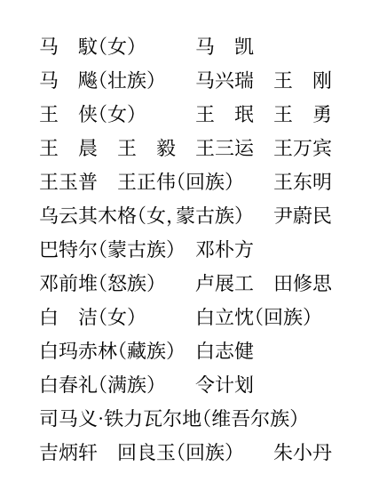

# Typst Tricorder——占三格法花名册

Record Chinese names with a rhythm of three characters.
按占三格的节奏记录中文人名。

## TODO

- [ ] on this repo, create a secret `REGISTRY_TOKEN` (at `https://github.com/[user]/[repo]/settings/secrets/actions`) that contains the so created token

```typ
#import "@preview/tricorder:0.1.0": *
```


